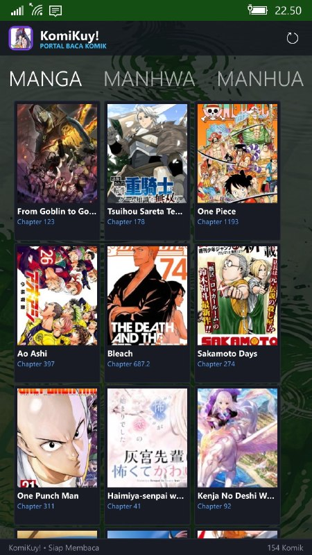

<div align="center">


# KomiKuy

A native Universal Windows Platform (UWP) comic and manga reader for Windows 10 Mobile and Windows 10.

[](https://github.com/WhaTheFoxSay/KomiKuy)
[](https://github.com/WhaTheFoxSay/KomiKuy)
[-green.svg?style=flat-square)](https://github.com/WhaTheFoxSay/KomiKuy)
[](https://github.com/WhaTheFoxSay/KomiKuy)
[](LICENSE)

</div>

---

## Overview

KomiKuy is a free comic and manga reader app built for Windows 10 Mobile and Windows 10 devices. Designed with ease of use in mind, it lets you discover, search, and read your favorite titles directly on your phone or PC with smooth and responsive performance.

---

## Screenshots

<div align="center">
  <table>
    <tr>
      <td align="center" width="20%">
        <br />
        <sub><b>Catalog Grid</b></sub>
      </td>
      <td align="center" width="20%">
        <br />
        <sub><b>Popular Rankings</b></sub>
      </td>
      <td align="center" width="20%">
        <br />
        <sub><b>Title Details</b></sub>
      </td>
      <td align="center" width="20%">
        <br />
        <sub><b>Genre Browse</b></sub>
      </td>
      <td align="center" width="20%">
        <br />
        <sub><b>Vertical Reader</b></sub>
      </td>
    </tr>
  </table>
</div>

---

## Key Features

- **Fast & Responsive Startup**: Opens immediately without long loading screens. Catalogs and cover artwork are cached locally so you can browse titles smoothly even on slow connections.
- **Manga, Manhwa, and Manhua**: Browse thousands of titles organized into Japanese Manga, Korean Webtoons (Manhwa), and Chinese Manhua with Indonesian translations.
- **Comfortable Vertical Reader**: Read with smooth continuous vertical scrolling, designed specifically for convenient one-handed reading on mobile screens.
- **Lightweight & Battery Friendly**: Runs smoothly on older phones (including devices with 512 MB or 1 GB of RAM like the Lumia 535) without lagging or draining battery quickly.
- **Automatic Bookmarks & Resume**: Automatically saves your last read chapter and page position so you can pick up exactly where you left off.
- **Genre Search & Filtering**: Search titles easily by name or browse through popular categories such as Action, Adventure, Fantasy, Romance, and Sci-Fi.
- **Eye-Friendly Dark Mode**: Uses a clean dark theme designed for comfortable reading in low light while saving battery life on OLED and LCD displays.

---

## System Requirements and Supported Devices

### Minimum Requirements
- **OS**: Windows 10 Mobile (Version 1511 / Build 10586 or later) or Windows 10 Desktop
- **Architecture**: ARM32 or x86
- **RAM**: 512 MB minimum (1 GB recommended)

### Compatible Devices
- **Lumia Series**: 520, 525, 530, 535, 620, 625, 630, 635, 640, 640 XL, 720, 730, 735, 820, 830, 920, 925, 930, 950, 950 XL, 1020, 1320, 1520
- **OEM Windows 10 Mobile Devices**: HP Elite x3, Alcatel Idol 4S, Acer Liquid Jade Primo
- **Windows 10 / 11 PC**: Any x86/x64/ARM64 machine running Windows 10 version 1511 or later

---

## Installation Guide

### Method 1: Install via MetroStore UWP (Recommended)

KomiKuy is officially available on **MetroStore UWP**, the community store client for Windows 10 Mobile and Windows Phone devices. Installing via MetroStore provides direct one-tap installation and updates without manual sideloading.

<div align="center">
  <a href="https://metrostore.github.io/#">
    
  </a>
</div>

1. Open or install **MetroStore** on your Windows 10 Mobile device by following the instructions at [metrostore.github.io](https://metrostore.github.io/#).
2. Search for **KomiKuy** within the store catalog.
3. Tap **Install** to automatically download, install certificates, and deploy the application package to your device.

---

### Method 2: Manual Installation (Sideloading)

If you prefer to install the application manually without using MetroStore:

#### Step 1: Install Developer Certificate
1. Download `Aya.cer` from the [Releases](https://github.com/WhaTheFoxSay/KomiKuy/releases) section or the `builds/` directory.
2. Transfer the certificate to your phone (via USB transfer or Microsoft Edge).
3. Open the file on your device and install it into the **Trusted Root Certification Authorities** store.

#### Step 2: Enable Developer Mode
1. Open **Settings** on your phone.
2. Navigate to **Update & Security** > **For developers**.
3. Select **Developer mode**.

#### Step 3: Install Application Package
1. Download `KomiKuy_v1.0.0_ARM.appx` from the [Releases](https://github.com/WhaTheFoxSay/KomiKuy/releases) page.
2. Open the file using the built-in **File Explorer** app on your phone and confirm the installation.
3. The application will appear in the App List once installation completes.

---

## Building from Source (Optional / For Contributors)

*Note: You do not need to build the project yourself to use KomiKuy. Regular users can simply download and install the ready-to-use package from the [Releases](https://github.com/WhaTheFoxSay/KomiKuy/releases) page by following the installation guide above.*

### Prerequisites
- Visual Studio 2019 or Visual Studio 2022
- Workload: Universal Windows Platform development
- Windows 10 SDK (Build 10.0.19041.0 or newer)

### Build Steps
1. Clone the repository:
   ```powershell
   git clone https://github.com/WhaTheFoxSay/KomiKuy.git
   cd KomiKuy
   ```
2. Execute the automated build script:
   ```powershell
   powershell -ExecutionPolicy Bypass -File .\build_and_sign.ps1
   ```
3. The build output will be placed in the `builds/` directory:
   - `builds/KomiKuy_v1.0.0_ARM.appx`
   - `builds/Aya.cer`

---

## Repository Structure

```text
KomiKuy/
├── KomiKuy.sln                  # Visual Studio Solution
├── build_and_sign.ps1           # Build and signing script
├── builds/
│   └── Aya.cer                  # Public developer certificate
├── docs/
│   ├── metrostore.png           # MetroStore badge asset
│   └── screenshots/             # Application screenshots
└── src/
    ├── App.xaml / App.xaml.cs   # Application entry point and lifecycle
    ├── Mangaplus.csproj         # UWP C# project file
    ├── Package.appxmanifest     # App identity and capabilities
    ├── Assets/                  # Visual assets, icons, and catalog data
    ├── Helpers/                 # Display and resolution utilities
    ├── Models/                  # Data structures (MangaTitle, ChapterItem, History)
    ├── Services/                # Parsing engine, API clients, and storage services
    └── Views/                   # UI views (MainPage, TitleDetailPage, ReaderPage)
```

---

## License and Disclaimer

This project is distributed under the terms of the [MIT License](LICENSE).

All comic titles, images, and trademarks displayed within the application are the property of their respective owners and publishers. This application is an independent open-source client developed for educational and interoperability purposes on legacy mobile platforms.
